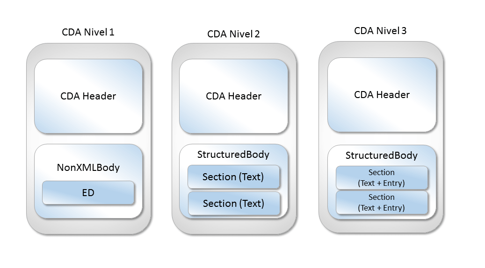

# FHIR - GUIDE

## What is FHIR?

FHIR ( Fast Interoperability Healthcare Information Resource ) is a standard for health care data exchange, developed by HL7. It promotes interoperability in healthcare IT systems, enabling different systems to communicate effectively and share patient data securely and consistently.

It consists of five main things:

1. A robust data model for describing health and administrative data
2. A RESTful API for interacting with that data using either JSON or XML
3. A set of open source tools to implement and test FHIR applications
4. A collection of FHIR Servers around the world that you can interact with
5. A community of implementers working together

**The 80:20 rule**

1. **80%** - Specification covers only what is needed by 80% of systems worldwide
2. **20%** - FHIR is easy to extend for your use cases, using **extensions** to save data not defined in the structure.

## How does FHIR implements interoperability?

By standardizing data structures and APIs for exchanging electronic health records. It can leverage modern protocols like REST to make it for scalable and flexible.

## Difference between HL7 V2, HL7 V3, HL7 CDA and FHIR

### HL7 V2

Uses a non-XML format, instead it uses a syntax based on **segments ( lines )** and **one-character delimiters**. Each segment has a **composite ( fields )** separated by the composite delimiter. The composites can have sub-composites and the sub-composites sub-sub-composites.

**Delimiters**

- carriage return: segment-separator
- |  ( pipe ): field separator
- ^ ( caret ): component separator
- & ( ampersand ): sub component separator
- '#' ( number sign ): default truncation separator
- ~ ( tilde ): default repetition separator

Each segment starts with a 3-character string that identifies the segment type, so each segment contains one specific category of information.

Every message starts with **MSH** as its first argument, which includes a field that identifies the message type.

```bash
MSH|^~\&|MegaReg|XYZHospC|SuperOE|XYZImgCtr|20060529090131-0500||ADT^A01^ADT_A01|01052901|P|2.5
EVN||200605290901||||
PID|||56782445^^^UAReg^PI||KLEINSAMPLE^BARRY^Q^JR||19620910|M||2028-9^^HL70005^RA99113^^XYZ|260 GOODWIN CREST DRIVE^^BIRMINGHAM^AL^35209^^M~NICKELL’S PICKLES^10000 W 100TH AVE^BIRMINGHAM^AL^35200^^O|||||||0105I30001^^^99DEF^AN
PV1||I|W^389^1^UABH^^^^3||||12345^MORGAN^REX^J^^^MD^0010^UAMC^L||67890^GRAINGER^LUCY^X^^^MD^0010^UAMC^L|MED|||||A0||13579^POTTER^SHERMAN^T^^^MD^0010^UAMC^L|||||||||||||||||||||||||||200605290900
OBX|1|NM|^Body Height||1.80|m^Meter^ISO+|||||F
OBX|2|NM|^Body Weight||79|kg^Kilogram^ISO+|||||F
AL1|1||^ASPIRIN
DG1|1||786.50^CHEST PAIN, UNSPECIFIED^I9|||A
```

**MSH** Header segment ( Intent, source or destination )

**EVN** Event type

**PID** Patient Identification

**PV1** Patient Visit

**OBX** Observation / Result 

**AL1** Patient Allergy Information

**DG1** Diagnosis

[https://hl7-definition.caristix.com/v2/HL7v2.5.1/Segments](https://hl7-definition.caristix.com/v2/HL7v2.5.1/Segments)

### HL7 V3

It is based on a format methodology ( HDF - HL7 Development Framework ) and with object-oriented principles, it uses an XML-based language for encoding the messages, it includes several sub-standards, including **Clinical Document Architecture (CDA).**

**RIM - ISO/HL7 21731** 

Is the **Reference Information Model** ( RIM ) is the cornerstone of the HL7 V3 development process, it expresses the data content needed in a specific clinical or administrative context and provides an explicit representation of the semantic and lexical connections.

**HL7 Development Framework ( HDF ) - ISO/HL7 27931**

Is a continuos evolving process that seeks to develop specifications that facilitate interoperability between healthcare systems.

**This is the most current edition of the HL7 V3 methodology.**

Not only **HDF** documents messaging, but also the processes, tools, actors, rules, and artifacts relevant to the development of all HL7 standard specifications.

```xml
<POLB_IN224200 ITSVersion="XML_1.0" xmlns="urn:hl7-org:v3"
 xmlns:xsi="http://www.w3.org/2001/XMLSchema-instance">  
  <id root="2.16.840.1.113883.19.1122.7" extension="CNTRL-3456"/>
  <creationTime value="200202150930-0400"/>
  <!-- The version of the datatypes/RIM/vocabulary used is that of May 2006 -->
  <versionCode code="2006-05"/>
  <!-- interaction id= Observation Event Complete, w/o Receiver Responsibilities -->
  <interactionId root="2.16.840.1.113883.1.6" extension="POLB_IN224200"/>
  <processingCode code="P"/>
  <processingModeCode nullFlavor="OTH"/>
  <acceptAckCode code="ER"/>
  <receiver typeCode="RCV">
    <device classCode="DEV" determinerCode="INSTANCE">
      <id extension="GHH LAB" root="2.16.840.1.113883.19.1122.1"/>
      <asLocatedEntity classCode="LOCE">
        <location classCode="PLC" determinerCode="INSTANCE">
          <id root="2.16.840.1.113883.19.1122.2" extension="ELAB-3"/>
        </location>
      </asLocatedEntity>
    </device>
  </receiver>
  <sender typeCode="SND">
    <device classCode="DEV" determinerCode="INSTANCE">
      <id root="2.16.840.1.113883.19.1122.1" extension="GHH OE"/>
      <asLocatedEntity classCode="LOCE">
        <location classCode="PLC" determinerCode="INSTANCE">
          <id root="2.16.840.1.113883.19.1122.2" extension="BLDG24"/>
        </location>
      </asLocatedEntity>
    </device>
  </sender>
  <!-- Trigger Event Control Act & Domain Content -->
</POLB_IN224200>
```

### HL7 CDA - Clinical Document Architecture

It is a **HL7 V3 Standard** in XML format to facilitate interoperability of medical records.

Facilitates the exchange of clinical records, leveraging some existing coding standards like SNOMED CT ( Systematized Nomenclature of Medicine - Clinical Terms ) and LOINC ( Logical Observation Identifiers Names and Codes ) or ICD-10 ( International Classification of Diseases)

Some of its characteristics are:

1. Persistence
    1. Remain unaltered and long term use, independent of external changes
2. Stewardship
    1. Maintained by an trustworthy organization, like an Hospital
3. Potential for authentication
    1. Legal certification of the medical data
4. Context
    1. Patient Identity, document author, Clinical act
5. Wholeness
    1. Complete document of the medical record, not by pieces
6. Human readability
    1. Must legible or easy to understand by a human

Structure

1. CDA Header: Metadata about the document
    - ClinicalDocument: root element of a CDA document, all other elements are nested within this element
        
        ```xml
        <ClinicalDocument xmlns:xsi="http://www.w3.org/2001/XMLSchema-instance" xmlns="urn:hl7-org:v3" xmlns:voc="urn:hl7-org:v3/voc" xmlns:sdtc="urn:hl7-org:sdtc">
        ```
        
    - realmCode: Realm representation of the document, usually representing the country or region where the document was created.
        
        ```xml
        <realmCode code="US"/>
        ```
        
    - typeId: Represents the type of the document.
        
        ```xml
        <typeId extension="POCD_HD000040" root="2.16.840.1.113883.1.3"/>
        ```
        
    - templateid: Identifies the specific template that the document is based on.
        
        ```xml
        <templateId root="2.16.840.1.113883.10.20.22.1.2" extension="2014-06-09"/>
        ```
        
    - id: A unique identifier for the document
        
        ```xml
        <id extension="EHRVersion2.0" root="be84a8e4-a22e-4210-a4a6-b3c48273e84c"/>
        ```
        
    - code: The code identifying the type of clinical document
        
        ```xml
        <code code="34133-9" displayName="Summary of episode note" codeSystem="2.16.840.1.113883.6.1" codeSystemName="LOINC"/>
        ```
        
    - title: Document Title
        
        ```xml
        <title>Summary of Patient Chart</title>
        ```
        
    - effectiveTime: The date and time when the document was created
        
        ```xml
        <effectiveTime value="20141015103026-0500"/>
        ```
        
    - confidentialityCode: Code representing the confidentiality level of the document
        
        ```xml
        <confidentialityCode code="N" displayName="normal" codeSystem="2.16.840.1.113883.5.25" codeSystemName="Confidentiality"/>
        ```
        
    - languageCode: The language in which the document is written
        
        ```xml
        <languageCode code="en-US"/>
        ```
        
    - setId and versionNumber: These are used when a document is revised. The setid remains the same across all version of a document, and the versionNumber is incremented for  each new version.
        
        ```xml
        <setId extension="sTT988" root="2.16.840.1.113883.19.5.99999.19"/>
        <versionNumber value="1"/>
        ```
        
    - recordTarget: Information about the patient who is the subject of the document
        
        ```xml
        <recordTarget>
         <!-- Patient Information -->
        </recordTarget>
        ```
        
    - author: Information about the author or authors of the document
        
        ```xml
        <author>
        		<time value="20141015103026-0500"/>
        		<assignedAuthor>
        			<id extension="5555555555" root="2.16.840.1.113883.4.6"/>
        			<code code="207QA0505X" displayName="Allopathic &amp; Osteopathic Physicians; Family Medicine, Adult Medicine" codeSystem="2.16.840.1.113883.6.101" codeSystemName="Healthcare Provider Taxonomy (HIPAA)"/>
        			<addr>
        				<streetAddressLine>1004 Healthcare Drive </streetAddressLine>
        				<city>Portland</city>
        				<state>OR</state>
        				<postalCode>99123</postalCode>
        				<country>US</country>
        			</addr>
        			<telecom use="WP" value="tel:+1(555)555-1004"/>
        			<assignedPerson>
        				<name>
        					<given>Patricia</given>
        					<given qualifier="CL">Patty</given>
        					<family>Primary</family>
        					<suffix qualifier="AC">M.D.</suffix>
        				</name>
        			</assignedPerson>
        		</assignedAuthor>
        	</author>
        
        ```
        
    - dataEnterer ( optional ): Information about the person who entered the data, If different from the author
        
        ```xml
        <dataEnterer>
        		<assignedEntity>
        			<id extension="333777777" root="2.16.840.1.113883.4.6"/>
        			<addr>
        				<streetAddressLine>1007 Healthcare Drive</streetAddressLine>
        				<city>Portland</city>
        				<state>OR</state>
        				<postalCode>99123</postalCode>
        				<country>US</country>
        			</addr>
        			<telecom use="WP" value="tel:+1(555)555-1050"/>
        			<assignedPerson>
        				<name>
        					<given>Ellen</given>
        					<family>Enter</family>
        				</name>
        			</assignedPerson>
        		</assignedEntity>
        	</dataEnterer>
        ```
        
    - custodian: Information about the organization responsible for maintaining the document.
        
        ```xml
        <custodian>
        		<assignedCustodian>
        			<representedCustodianOrganization>
        				<id extension="321CX" root="1.1.1.1.1.1.1.1.3"/>
        				<name>Good Health HIE</name>
        				<telecom use="WP" value="tel:+1(555)555-1009"/>
        				<addr use="WP">
        					<streetAddressLine>1009 Healthcare Drive </streetAddressLine>
        					<city>Portland</city>
        					<state>OR</state>
        					<postalCode>99123</postalCode>
        					<country>US</country>
        				</addr>
        			</representedCustodianOrganization>
        		</assignedCustodian>
        	</custodian>
        ```
        
    - authentication ( optional ): Signatures or other forms of authentication of the document
        
        ```xml
        <authenticator>
        		<time value="20141015103026-0500"/>
        		<signatureCode code="S"/>
        		<assignedEntity>
        			<id extension="5555555555" root="2.16.840.1.113883.4.6"/>
        			<code code="207QA0505X" displayName="Allopathic &amp; Osteopathic Physicians; Family Medicine, Adult Medicine" codeSystem="2.16.840.1.113883.6.101" codeSystemName="Healthcare Provider Taxonomy (HIPAA)"/>
        			<addr>
        				<streetAddressLine>1004 Healthcare Drive </streetAddressLine>
        				<city>Portland</city>
        				<state>OR</state>
        				<postalCode>99123</postalCode>
        				<country>US</country>
        			</addr>
        			<telecom use="WP" value="tel:+1(555)555-1004"/>
        			<assignedPerson>
        				<name>
        					<given>Patricia</given>
        					<given qualifier="CL">Patty</given>
        					<family>Primary</family>
        					<suffix qualifier="AC">M.D.</suffix>
        				</name>
        			</assignedPerson>
        		</assignedEntity>
        	</authenticator>
        ```
        

1. CDA Body
    
    The data is structured in **sections** with each section representing a different aspect of the patient’s health or healthcare history. The body is contained within the **********************<structuredBody>**********************  element in the CDA XML
    
    ```xml
    <component>
        <structuredBody>
            <component>
                <section>
                    <templateId root="2.16.840.1.113883.10.20.22.2.6"/>
                    <code code="11450-4" displayName="Problem list" codeSystem="2.16.840.1.113883.6.1" codeSystemName="LOINC"/>
                    <title>Problem List</title>
                    <text>
                        <!-- Narrative text for this section -->
                    </text>
                    <entry>
                        <!-- Structured data for this section -->
                    </entry>
                </section>
            </component>
            <!-- Additional components/sections as needed -->
        </structuredBody>
    </component>
    ```
    
    [https://github.com/HL7/C-CDA-Examples/blob/master/Documents/CCD/CCD 2/CCD.xml](https://github.com/HL7/C-CDA-Examples/blob/master/Documents/CCD/CCD%202/CCD.xml)
    
    The information can be structured in different ways, according to the structure level.
    
    
    

## What is a FHIR Resource?

A FHIR resource is a basic unit of interoperability in FHIR, and each resource represents a different type of data, with their own structure and set of properties, represented in JSON, XML or RFD or Turtle.


1. **Metadata**: 
    1. Resource ID
    2. Resource Version
    3. Tags
    4. Profiles
2. **Extensions**
    1. Any Information that did not fit in the 20%
3. **Narrative**
    1. Human-readable version of the content ( Optional in HTML )
    2. CDA has taught us that this is very important
4. **Body**
    1. Raw structured data
    

FHIR defines a set of roughly 150 resources

Some examples are:

1. Patient - Person who receives healthcare
2. Encounter - A doctor’s appointment or hospital stay
3. Observation - Device reading or lab value
4. DiagnosticReport - Whole lab or Xray report
5. MedicationPrescription - Rx for meds

```bash
{
	"resourceType": "Observation",
	"id": "287",
	"meta": {
		"versionId": "2"
	},
	"text": {
		"div": "<div> Fasting glucose of <b>11.2 mg/dl</b></div>",
	},
	"status": "final",
	"code": {
		"coding": [
			{
				"system":"http://lonic.org",
				"code":"4160-0",
				"display":"Fasting glucose by Glucometer"
			}
		]
	},
	"effectiveDateTime": "2015-02-12T09:30:00-00-05:00",
	"valueQuantity": {
		"value": 11.2,
		"system": "http://unitsofmeasure.org",
		"code":"mg/dl"
	}
}
```

## FHIR Search

Is a key functionality in the FHIR standard that allows clients to query resources from a FHIR server. It provides a standardized way to search and filter healthcare data stored in a FHIR-compatible system. FHIR search provides a wide range of capabilities, from simple queries for a specific resource to complex queries involving multiple parameters and modifiers.

```
GET [base]/Patient?name=smith
```

It is also possible to chain parameters together to create more complex queries

```
GET [base]/Observation?patient.name=smith&code=29463-7
```

A search can also involve an **Operation** invoked by making a HTTP POST or GET request to a specific URL.

There are levels of operations:

1. **System-level operations:** Invoked at the root endpoint of the FHIR server
    
    ```
    [base]/$operation-name
    ```
    
2. **Type-level operations:** Invoked at the resource type endpoint
    
    ```
    [base]/resource-type/$operation-name
    ```
    
3. **Instance-level operation:** Invoked at the endpoint for a specific resource instance
    
    ```
    [base]/resource-type/resource-id/$operation-name
    ```
    

Some standard operations defined in the FHIR specification include

- **$validate** - checks if a resource is valid
- **$everything** - for a patient, it returns all information related to the patient
- **$meta-add, $meta-delete** - adds or deletes metadata from a resource
- **$convert** - converts data from one form to another
- **$document** - generates a document for a given composition

## SMART on FHIR

SMART on FHIR ( Substitutable Medical Applications, Reusable Technology on Fast Healthcare Interoperability Resources ) is a protocol for building plug-and-play healthcare applications that can be easily integrated into existing systems.

Key aspects:

- **Single Sign-On:** Leverages OAuth 2.0 and OpenID Connect to allow users to authenticate themselves and prove their identities.
- **Contextual Launch:** When a SMART on FHIR app is launched from within a healthcare system, it can receive context about the current user, patient, and other relevant data.

## Bundles

When operations are successful it returns a ************Bundle************ resource, which is a container for other resources. The Bundle resource contains a collection of entries, and each entry holds a resource that matches the search criteria, along with some additional metadata.

```json
{
  "resourceType": "Bundle",
  "id": "search-result-uuid",
  "type": "searchset",
  "total": 2,
  "link": [
    {
      "relation": "self",
      "url": "http://example.com/fhir/Patient?name=smith"
    }
  ],
  "entry": [
    {
      "fullUrl": "http://example.com/fhir/Patient/123",
      "resource": {
        "resourceType": "Patient",
        "id": "123",
        // Patient details here
      },
      "search": {
        "mode": "match"
      }
    },
    {
      "fullUrl": "http://example.com/fhir/Patient/456",
      "resource": {
        "resourceType": "Patient",
        "id": "456",
        // Patient details here
      },
      "search": {
        "mode": "match"
      }
    }
  ]
}
```

## FHIR Consent

Is a specific type of resource used to record a patient’s consent or to provide the rules that should be applied about the processing of personal healthcare information.

## Terminology Service

Is a set of functionality defined in the FHIR specification that enables the use and management of code systems and terminologies used in healthcare.

The terminology service can perform several operations that assist in code validation, translation, and other important aspects of managing healthcare information. So basically it is a service that lets healthcare applications make use of codes and value sets without having to become experts in the fine details of code system, value set and concept map resources, and the underlying code systems and terminological principles.

It should support:

- XML and JSON FHIR formats
- READ and SEARCH interactions for CodeSystem, ValueSet and ConceptMap
- The following elements as search parameters for CodeSystem, ValueSet and ConceptMap
    - url
    - version
    - name
    - title
    - status
- The capabilities interaction with an absent **********mode********** parameter or a **********mode********** parameter with a value of **********full********** returning a **********************************CapabilityStatement********************************** resource which includes the following elements
    - url
    - version
    - name
    - title
    - status
    - date
    - description
    - kind
    - fhirVersion
- The capabilities interaction with a **********mode********** parameter with a value of ************************terminology************************ returning a **************TerminologyCapabilities************** resource which includes the following elements
    - url
    - name
    - title
    - status
    - date
    - kind with a fixed value of ****************instance****************
    - A **********************codesystem********************** data element containing each of the following sub elements for each code system supported for terminology services
        - codeSystem.uri
        - codeSystem.version
        - codeSystem.version.code
        - codeSystem.content

Operations

- ********************************$validate-code:******************************** Validates that a code is a member of a specific code system or value set
- ******************$lookup:****************** Provides details about a code within a given code system, such as the display text or other properties
- ******************$expand:****************** Expands a value set to list all codes it includes
- ************************$translate:************************ Translates a code from one codesystem to another, if a mapping exists
- ********************$closure:******************** Maintains a “closure table”, which is a record of equivalences and subsumption between codes from different code systems
- **********************$subsumes:********************** Given two codes in the same hierarchy, this operation returns information about their relative positions in the hierarchy

```
Expanding a value set that is already registered on the server as "23",
with a text filter of "abdo":

GET [base]/ValueSet/23/$expand?filter=abdo
```

```
Expanding a value set that is specified by the client (using JSON):

POST [base]/ValueSet/$expand

{
  "resourceType" : "Parameters",
  "parameter" : [
     {
     "name" : "valueSet",
     "resource" : {
       "resourceType" : "ValueSet",
     [value set details]
     }
   }
  ]
}
```

## Subscription Resource

The **********Subscription********** resource is used to establish proactive event notifications from a FHIR server to another system. Subscribers request event notifications within a predefined **********************************SubscriptionTopic********************************** that the server support and can further refine their notifications by supplying filters.

Each ************************************SubscriptionTopic************************************ resource defines a set of allowed filters

( **************************************************************SubscriptionTopic.canFilterBy************************************************************** ), which a subscriber refer to within a **************************Subscription************************** resource 

( ********************************************Subscription.filterBy******************************************** ). Once a subscription is created, any event matching a specified SubscriptionTopic that meets the filtering criteria will cause a notification to be sent using the provided channel. Notifications are **************Bundle************** resources, of type **************************************subscription-notification.**************************************

Several channels are defined in the core specification:

- **********************rest-hook:********************** Notifications are sent via HTTP POST to the ********************************************Subscription.endpoint******************************************** URL
- **********************websocket:********************** Notifications are sent via WS/S to a client connected via WebSocket
- **************email:************** Notifications are sent via SMTP/S, S/MIME, or Direct SMTP to the ******************************************Subscription.endpoint****************************************** email URI
- ******************message:****************** Notifications are sent via FHIR messaging to the application identified in the ********************************************Subscription.endpoint******************************************** URI

```json
{
  "resourceType": "Subscription",
  "id": "example",
  "status": "requested",
  "criteria": "Observation?code=http://loinc.org|1975-2",
  "channel": {
    "type": "websocket",
    "endpoint": "wss://websocket.example.org/fhir",
    "payload": "application/fhir+json"
  }
}
```

- ****************status:**************** The status of the subscription, which can be requested, active, error or off
- ****criteria:**** A FHIR search query that describes the conditions for the subscriptions. In this example, the subscription is set to trigger when an Observation resource with the LOINC code “1975-2” is created or updated
- ******************channel:****************** Defines where and how notifications should be sent
    - ************type:************ The type of the channel, which can be rest-hook, websocket, email or message
    - ********************endpoint:******************** The URL that will receive the notifications. The format of this URL will depend on the type of the channel
    - ******************payload:****************** The MIME type of the content that will be sent to the endpoint. Usually, this will be application/fhir+json or application/fhir+xml

## Modules

Refers to a coherent collection of resources, operations, or profiles that together serve a specific purpose or use case within a healthcare setting.

It might encompass all the resources and operations related to a specific workflow, such as patient admissions, laboratory testing or medication administration.

The official FHIR specification includes a variety of such modules, such as:

- **Clinical Reasoning Module:** This provides resources for decision support systems and clinical quality measurement
- **Diagnostic Module:** This covers areas like laboratory results, diagnostic reports, and specimen collection
- ****************************************Medications Module:**************************************** This provides resources related to medication prescriptions, dispensing and administration
- ********************************Patient Module:******************************** This provides resources related to patient demographics, care providers, and other foundational elements

## Interactions in FHIR

Refers to a specific type of operation that can be performed on or with a FHIR resource. Interactions define the types of operations that can be used in the context of a RESTful FHIR API.

Operation Types:

- ****************create:**************** Makes a new instance of a resource ( HTTP POST )
- ************read:************ Retrieves the current state of a resource ( HTTP GET with Resource ID )
- ****************update:**************** Changes the state of a resource ( HTTP PUT with a Resource ID )
- ****************delete:**************** Removes a resource ( HTTP DELETE with Resource ID )
- **************vread:************** Retrieves a specific version of a resource
    
    ( HTTP GET with Resource ID and version ID )
    
- ******************history:****************** Retrieves the history of changes to a resource or to all resources ( HTTP GET with _history on a resource instance, resource type, or the whole system )
- ****************search:**************** Retrieves all resources matching a set of specified search criteria ( HTTP GET with search parameters )
- ********patch:******** Changes some values in a resource without changing the whole resource ( HTTP PATCH with Resource ID )
- **************transaction:************** Performs multiple interactions in a single operation ( HTTP POST with a Bundle resource to the base system URL )
- ********batch:******** Performs multiple interactions and returns multiple responses in a single operation ( HTTP POST with a Bundle resource to the base system URL )

Each of these interactions can be performed on different levels:

- ****************************System level:**************************** Interactions involving all resources in a FHIR system
- ************************Type level:************************ Interactions involving all resources of a specific type in a FHIR system
- ********************************Instance level:******************************** Interactions involving a specific instance of a resource in a FHIR system

## FHIR Encodings

1. **JSON:** The most popular format
2. **XML**: Still very popular
3. **RDF/Turtle:** Only generally used in some research contexts
